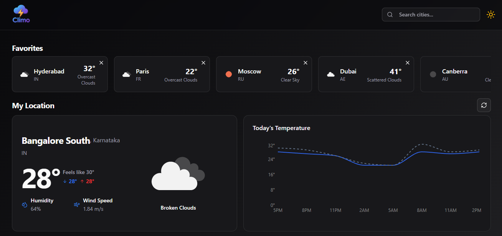

<div align="center">
  
  <h1>🌦️ Climo: Your Weather, Your Way!</h1>
  <p><em>The most fun, interactive, and modern weather dashboard </em></p>
</div>

---

## 🚀 What is Climo?
Climo is a lightning-fast, visually stunning weather dashboard built with React, TypeScript, and Vite. It brings you real-time weather updates, forecasts, and more—all with a playful, user-friendly interface that makes checking the weather a joy, not a chore!

---

## 🏁 Getting Started
1. **Clone the repo:**
   ```bash
   git clone https://github.com/your-username/climo.git
   cd climo
   ```
2. **Install dependencies:**
   ```bash
   npm install
   ```
3. **Start the app:**
   ```bash
   npm run dev
   ```
4. **Open in browser:**
   Navigate to [http://localhost:5173](http://localhost:5173) and enjoy!

---

## ✨ Special Features
- **Automatic Geolocation:**
  - Instantly detects your location and shows local weather. No typing required!
- **Favorite Cities:**
  - Save and switch between your favorite places with a single click.
- **Live Weather & Forecasts:**
  - Real-time data powered by OpenWeather APIs. Hourly, daily, and detailed metrics.
- **Beautiful UI:**
  - Modern, responsive design with smooth animations and skeleton loaders.
- **Error Handling:**
  - Friendly alerts and retry options if something goes wrong.
- **Accessible & Mobile-Ready:**
  - Works great on any device, for everyone.

---

## 🎉 Why Climo is Different
- **Fun to Use:**
  - Playful icons, engaging interactions, and a dashboard that feels alive.
- **No More Boring Weather Apps:**
  - Climo turns weather checking into a delightful experience.
- **Smart & Personal:**
  - Remembers your favorite cities and search history.
- **Open Source & Extensible:**
  - Easy to customize, hack, and extend for your own needs.
- **Built for Developers:**
  - Clean code, modular components, and TypeScript everywhere.

---

## 🛠️ Tech Stack

---

**React** · **TypeScript** · **Tailwind CSS** · **React Query** · **OpenWeather API**

## 🧑‍💻 Technical Details

- Modular React components (`src/components/`)
- Custom hooks for geolocation and weather data
- React Query for caching and background updates
- TypeScript for type safety
- Context for theme and state management
- Tailwind CSS for responsive layouts
- Skeleton loaders for smooth UX
- Friendly error alerts and retry logic
- Local storage for favorites and history

---

---

## 📸 Screenshots


---

<div align="center">
  <strong>Made with ☀️, ☁️, and ❤️ by a fellow Bengaluru weather lover!</strong>
</div>

